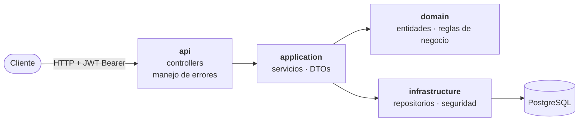
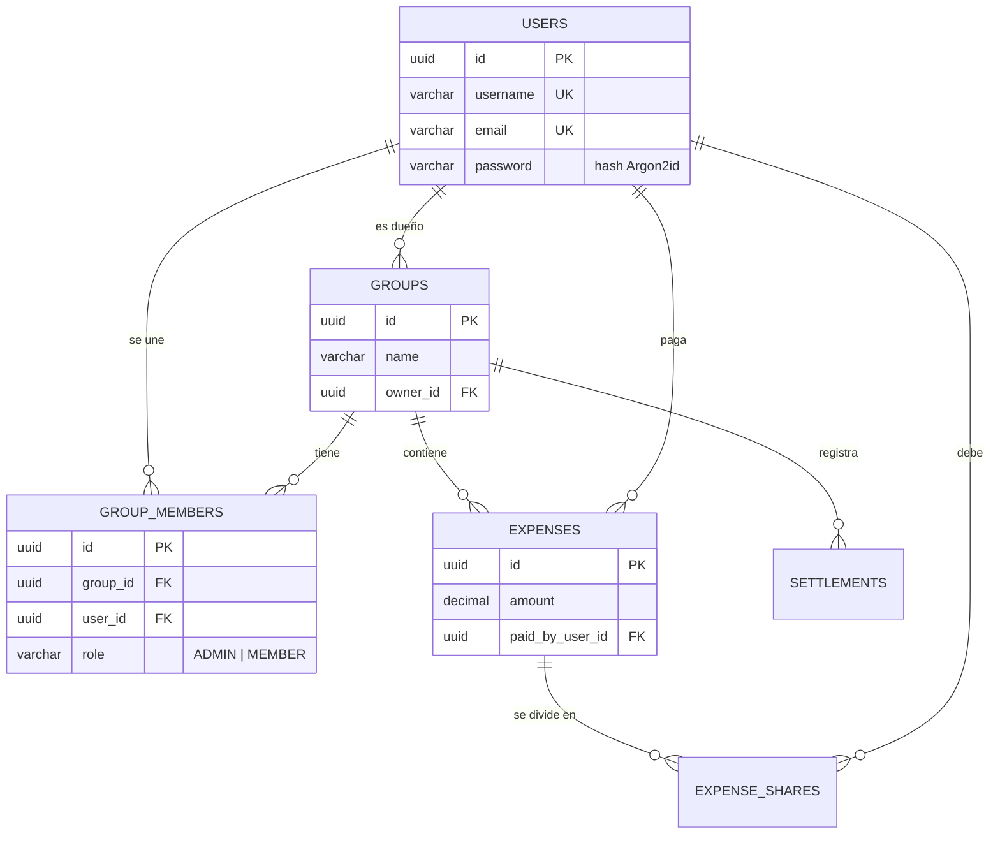

<div align="center">

# 🧾 Cuadremos

**Dividir gastos compartidos. Mantener las cuentas claras.**

*"¡Cuadremos!": porque la plata no debería ser un problema entre amigos.*

[](https://github.com/cris-sh/cuadremos/actions/workflows/ci.yaml)


[](LICENSE)

[English](README.md) · **Español**

</div>

---

## ✨ ¿Qué es Cuadremos?

Cuadremos es una API REST para dividir gastos entre amigos, familia, roommates o compañeros de viaje. Creas un grupo, registras quién pagó qué, y la API calcula quién le debe a quién y cuáles son los pagos mínimos para quedar a paz y salvo.

Si has usado apps como Splitwise o Tricount, la idea te resultará familiar.

Cuadremos nació como un proyecto personal para aprender ingeniería backend construyendo algo real, por eso tiene arquitectura por capas, seguridad, testing, migraciones de base de datos y CI desde el primer día.

## 🚦 Estado

| Funcionalidad | Estado |
|---|---|
| 🔐 Registro y login con JWT | ✅ Listo |
| 👥 Grupos con dueño, admins y miembros | ✅ Listo |
| 🛡️ Permisos dentro del grupo | 🚧 En progreso |
| 💰 Gastos (división igual, exacta y por porcentaje) | 🗺️ Planeado |
| ⚖️ Balances y "quién le debe a quién" | 🗺️ Planeado |
| 💸 Sugerencias de pago con mínimo de transferencias | 🗺️ Planeado |

## 🧰 Tecnologías

| Capa | Herramientas |
|---|---|
| Lenguaje y framework | Java 21 · Spring Boot 4.1 · Spring Web MVC |
| Seguridad | Spring Security · OAuth2 Resource Server (JWT, HS256) · Argon2id |
| Persistencia | Spring Data JPA · Hibernate · PostgreSQL · Flyway |
| Testing | JUnit 5 · Mockito · AssertJ · MockMvc · Spring Security Test |
| Herramientas | Maven · Lombok · GitHub Actions · Dependabot |

## 🏗️ Arquitectura

El código está dividido en capas, y cada una solo habla con la de abajo.



```
src/main/java/pw/cris/cuadremos
├── api/              → controllers REST y manejador global de errores
├── application/      → servicios (casos de uso) y DTOs de entrada/salida
├── domain/           → entidades, roles y excepciones del dominio
└── infrastructure/   → repositorios JPA, JWT y configuración de seguridad
```

## 🗃️ Modelo de datos



## 🔌 API

| Método | Endpoint | Auth | Descripción |
|---|---|---|---|
| `POST` | `/api/auth/register` | — | Crear una cuenta |
| `POST` | `/api/auth/login` | — | Obtener un token JWT |
| `POST` | `/api/groups` | 🔑 | Crear un grupo (quedas como dueño) |
| `GET` | `/api/groups/{groupId}` | 🔑 | Ver un grupo y sus miembros |
| `POST` | `/api/groups/{groupId}/members` | 🔑 | Agregar un miembro por username |

<details>
<summary><b>Pruébalo con curl</b></summary>

```bash
# 1. Registrarse
curl -X POST localhost:8080/api/auth/register \
  -H "Content-Type: application/json" \
  -d '{"username":"cris","name":"Cristian","email":"cris@example.com","password":"supersecret123"}'

# 2. Iniciar sesión y copiar el token
curl -X POST localhost:8080/api/auth/login \
  -H "Content-Type: application/json" \
  -d '{"username":"cris","password":"supersecret123"}'
# → {"accessToken":"eyJ...","tokenType":"Bearer","expiresIn":3600}

# 3. Crear un grupo
curl -X POST localhost:8080/api/groups \
  -H "Authorization: Bearer <accessToken>" \
  -H "Content-Type: application/json" \
  -d '{"name":"Viaje a Cúcuta"}'
```

Cada miembro viene con su `role` y un campo `owner`, para que el cliente pueda mostrar al dueño como un admin con 👑:

```json
{
  "id": "5f0c…",
  "name": "Viaje a Cúcuta",
  "members": [
    { "id": "9a1e…", "username": "cris", "name": "Cristian", "role": "ADMIN", "owner": true }
  ],
  "createdAt": "2026-09-25T18:30:00Z"
}
```

</details>

## 🚀 Cómo correrlo

**Requisitos:** Java 21 y una base de datos PostgreSQL 13+ (local, en Docker o en un servicio como Neon).

**1. Clonar**

```bash
git clone https://github.com/cris-sh/cuadremos.git
cd cuadremos
```

**2. Crear un archivo `.env`** en la raíz del proyecto (git lo ignora):

```properties
DATABASE_URL=jdbc:postgresql://localhost:5432/cuadremos
DATABASE_USERNAME=postgres
DATABASE_PASSWORD=postgres
# Mínimo 32 bytes. Genera uno con: openssl rand -base64 64
JWT_SECRET=cambia-esto-por-un-secreto-largo-y-aleatorio
```

**3. Arrancar**

```bash
./mvnw spring-boot:run
```

Flyway crea las tablas al primer arranque, y la API queda en `http://localhost:8080`.
```properties
DATABASE_URL=jdbc:postgresql://localhost:5432/cuadremos
DATABASE_USERNAME=postgres
DATABASE_PASSWORD=postgres
# Mínimo 32 bytes. Genera uno con: openssl rand -base64 64
JWT_SECRET=cambia-esto-por-un-secreto-largo-y-aleatorio
```

**3. Arrancar**

```bash
./mvnw spring-boot:run
```

Flyway crea las tablas al primer arranque, y la API queda en `http://localhost:8080`.

**4. Tests**

```bash
./mvnw test
```

> [!NOTE]
> `./mvnw test` incluye un test que arranca la app completa, se conecta a la base de datos de tu `.env` y aplica las migraciones pendientes. Los tests unitarios por sí solos no necesitan base de datos.

## 🧠 Decisiones de diseño

- **Contraseñas con Argon2id.** Es un algoritmo que exige mucha memoria para atacarlo y es la recomendación actual de OWASP. Las contraseñas nunca salen del servicio en texto plano.
- **Autenticación JWT sin sesiones.** Los tokens se firman con HS256 y llevan el id del usuario como `subject`, así que el servidor no guarda sesiones. Duran una hora.
- **Identidades normalizadas.** Usernames y emails se pasan a minúsculas antes de validarse y guardarse, así que `Cris` y `cris` nunca pueden ser dos cuentas.
- **La membresía es una entidad; la propiedad, una columna.** `group_members` guarda el rol de cada miembro, y `groups.owner_id` garantiza exactamente un dueño por grupo. Por eso traspasar la propiedad es un solo cambio.
- **Las entidades se comparan por id.** `User` implementa `equals`/`hashCode` por su id de base de datos, así que los conjuntos de miembros funcionan bien entre transacciones.
- **El esquema es código.** Cada cambio es una migración versionada de Flyway, y Hibernate solo *valida* el esquema; nunca lo modifica.
- **Errores de login genéricos a propósito.** Un login fallido nunca revela si el usuario existe.

## 🗺️ Hoja de ruta

- [x] **Fase 1 — Auth:** registro, login con JWT, endpoints protegidos
- [ ] **Fase 1 — Grupos:** roles y dueño ✅, permisos, sacar miembros, ascender admins, traspaso de propiedad, archivar
- [ ] **Fase 2 — Gastos:** división igual, exacta y por porcentaje; las partes siempre suman exacto al centavo
- [ ] **Fase 3 — Balances:** balance neto por miembro y minimización de deudas
- [ ] **Fase 4 — Producción:** Testcontainers, documentación OpenAPI, Docker Compose, logs estructurados
- [ ] **Fase 5 — Extras:** links de invitación, categorías, gastos recurrentes, multimoneda

## 📄 Licencia

Publicado bajo la [licencia MIT](LICENSE).

<div align="center">

Hecho con ☕ en Colombia por [cris-sh](https://github.com/cris-sh)

</div>