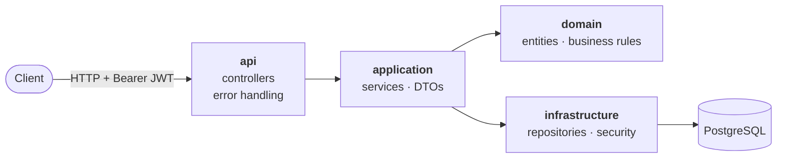
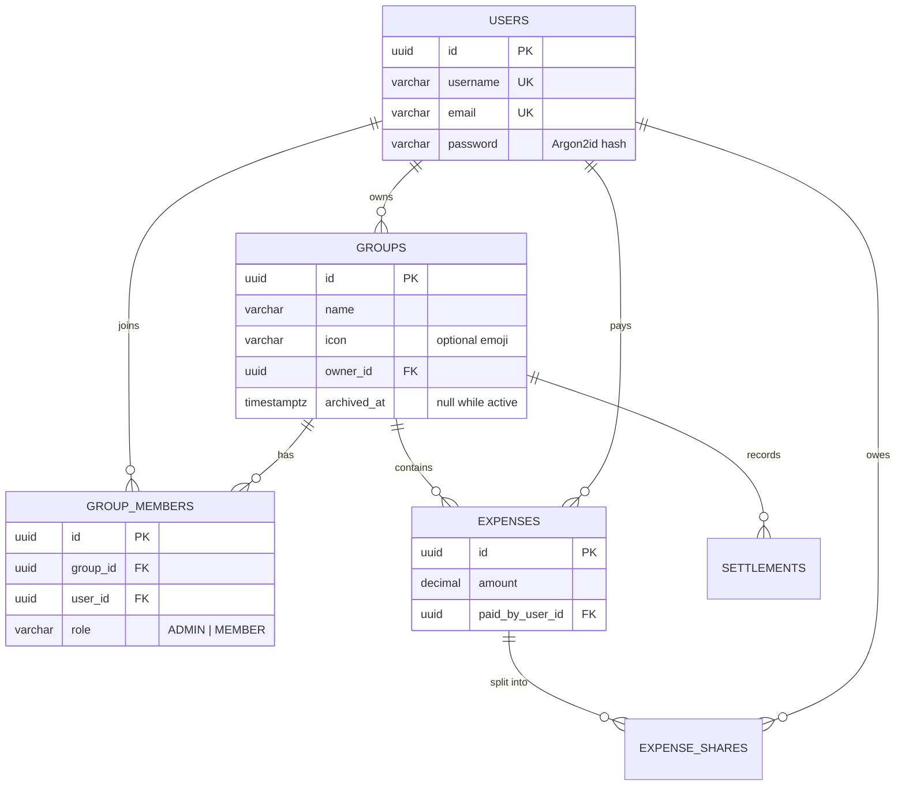

<div align="center">

# 🧾 Cuadremos

**Split shared expenses. Keep the accounts square.**

*"¡Cuadremos!" — Colombian for "let's settle up."*

[](https://github.com/cris-sh/cuadremos/actions/workflows/ci.yaml)


[](LICENSE)

**English** · [Español](README.es.md)
</div>

---

## ✨ What is Cuadremos?

Cuadremos is a REST API for splitting shared expenses with friends, family, roommates or travel buddies. Create a group, log who paid for what, and let the API work out who owes whom — and the fewest payments needed to settle up.

If you've used apps like Splitwise or Tricount, the idea will feel familiar.

Cuadremos started as a personal project to learn backend engineering by building something real, so it's built with layered architecture, security, testing, database migrations and CI from day one.

## 🚦 Status

| Feature                                          | Status         |
|--------------------------------------------------|----------------|
| 🔐 Registration & JWT login                      | ✅ Done         |
| 👥 Groups with owner, admins and members         | ✅ Done         |
| 🛡️ Group-level permissions                      | ✅ Done         |
| ✏️ Edit and archive groups                       | ✅ Done         |
| 📨 Invitations (consent before joining a group)  | 🚧 Next         |
| 💰 Expenses (equal, exact and percentage splits) | 🗺️ Planned    |
| ⚖️ Balances & "who owes whom"                    | 🗺️ Planned    |
| 💸 Settle-up suggestions with debt minimization  | 🗺️ Planned    |

## 🧰 Tech stack
| Layer | Tools                                                            |
|---|------------------------------------------------------------------|
| Language & Framework | Java 21 · Spring Boot 4.1 · Spring Web MVC                       |
| Security | Spring Security · OAuth2 Resource Server (JWT, HS256) · Argon2id |
| Persistence | Spring Data JPA · Hibernate · PostgreSQL · Flyway                |
| Testing | JUnit 5 · Mockito · AssertJ · MockMvc · Spring Security Test     |
| Tooling | Maven · Lombok · GitHub Actions · Dependabot |

## 🏗️ Architecture

The code is split into layers. Each one only talks to the layer below it.



```
src/main/java/pw/cris/cuadremos
├── api/              → REST controllers and the global exception handler
├── application/      → services (use cases) and request/response DTOs
├── domain/           → entities, roles and domain exceptions
└── infrastructure/   → JPA repositories, JWT and Spring Security config
```

## 🗃️ Data model



## 👥 Group roles

Every group has exactly one **owner**, who is always an admin too.

| Action | Member | Admin | Owner |
|---|:---:|:---:|:---:|
| View the group | ✅ | ✅ | ✅ |
| Leave the group | ✅ | ✅ | ❌ transfer ownership first |
| Add members | | ✅ | ✅ |
| Remove plain members | | ✅ | ✅ |
| Rename the group or change its icon | | ✅ | ✅ |
| Remove admins | | | ✅ |
| Grant or revoke admin | | | ✅ |
| Transfer ownership (to an admin) | | | ✅ |
| Archive the group | | | ✅ |

An **archived** group is read-only: members can still see it, but every change answers `409 Conflict`. Nothing is ever deleted, so the group's history survives.

## 🔌 API

| Method | Endpoint | Auth | Description |
|---|---|---|---|
| `POST` | `/api/auth/register` | — | Create an account |
| `POST` | `/api/auth/login` | — | Get a JWT access token |
| `POST` | `/api/groups` | 🔑 | Create a group (you become its owner) |
| `GET` | `/api/groups/{groupId}` | 🔑 | Get a group and its members |
| `PATCH` | `/api/groups/{groupId}` | 🔑 | Rename a group or change its icon (`""` removes it) |
| `DELETE` | `/api/groups/{groupId}` | 🔑 | Archive a group |
| `POST` | `/api/groups/{groupId}/members` | 🔑 | Add a member by username |
| `PATCH` | `/api/groups/{groupId}/members/{memberId}` | 🔑 | Change a member's role (`ADMIN` / `MEMBER`) |
| `DELETE` | `/api/groups/{groupId}/members/{memberId}` | 🔑 | Remove a member, or leave with your own id |
| `PUT` | `/api/groups/{groupId}/owner` | 🔑 | Transfer ownership to an admin |

Errors share one shape (`timestamp`, `status`, `error`, `message`) and use `400` for invalid input, `401` without a valid token, `403` when your role does not allow the action, and `409` when the group is archived.

<details>
<summary><b>Try it with curl</b></summary>

```bash
# 1. Register
curl -X POST localhost:8080/api/auth/register \
  -H "Content-Type: application/json" \
  -d '{"username":"cris","name":"Cristian","email":"cris@example.com","password":"supersecret123"}'

# 2. Log in and grab the token
curl -X POST localhost:8080/api/auth/login \
  -H "Content-Type: application/json" \
  -d '{"username":"cris","password":"supersecret123"}'
# → {"accessToken":"eyJ...","tokenType":"Bearer","expiresIn":3600}

# 3. Create a group
curl -X POST localhost:8080/api/groups \
  -H "Authorization: Bearer <accessToken>" \
  -H "Content-Type: application/json" \
  -d '{"name":"Trip to Cúcuta"}'

# 4. Give it an icon (fields you leave out keep their value)
curl -X PATCH localhost:8080/api/groups/<groupId> \
  -H "Authorization: Bearer <accessToken>" \
  -H "Content-Type: application/json" \
  -d '{"icon":"🏖️"}'
```

Every member comes back with a `role` and an `owner` flag, so a client can show the owner as an admin with a 👑:

```json
{
  "id": "5f0c…",
  "name": "Trip to Cúcuta",
  "icon": "🏖️",
  "members": [
    { "id": "9a1e…", "username": "cris", "name": "Cristian", "role": "ADMIN", "owner": true }
  ],
  "createdAt": "2026-09-25T18:30:00Z",
  "archivedAt": null
}
```

</details>

## 🚀 Getting started

**Prerequisites:** Java 21 and a PostgreSQL 13+ database (local, Docker or a hosted one like Neon).

**1. Clone**

```bash
git clone https://github.com/cris-sh/cuadremos.git
cd cuadremos
```

**2. Create a `.env` file** in the project root (it is git-ignored):

```properties
DATABASE_URL=jdbc:postgresql://localhost:5432/cuadremos
DATABASE_USERNAME=postgres
DATABASE_PASSWORD=postgres
# At least 32 bytes. Generate one with: openssl rand -base64 64
JWT_SECRET=change-me-to-a-long-random-secret
```

**3. Run**

```bash
./mvnw spring-boot:run
```

Flyway creates the schema on first start, and the API listens on `http://localhost:8080`.

**4. Test**

```bash
./mvnw test
```

> [!NOTE]
> `./mvnw test` includes a full application test that connects to the database in your `.env` and applies pending migrations. The unit tests alone need no database.

## 🧠 Design decisions

- **Argon2id password hashing.** Memory-hard, the current OWASP recommendation. Passwords never leave the service in plain text.
- **Stateless JWT auth.** Tokens are signed with HS256 and carry the user id as their subject, so no session is stored server-side. Tokens expire after one hour.
- **Normalised identities.** Usernames and emails are lowercased before they are checked and stored, so `Cris` and `cris` can never become two accounts.
- **Membership is an entity, ownership is a column.** `group_members` carries each member's role, while `groups.owner_id` guarantees exactly one owner per group and makes ownership transfers a single update.
- **Archive, never delete.** Groups hold shared money history, so the owner archives them instead of deleting them. An archived group stays readable and rejects every change.
- **Permissions before state.** Every change checks who is asking before it checks whether the group is archived, so an outsider gets `403` and learns nothing about the group.
- **Bearer tokens only, so no CSRF.** The API reads credentials only from the `Authorization` header and never sets cookies, so a forged cross-site request has nothing to ride on.
- **Entities compare by id.** `User` implements `equals`/`hashCode` by database id, so sets of members behave correctly across transactions.
- **The schema is code.** Every change is a versioned Flyway migration, and Hibernate only *validates* the schema; it never alters it.
- **Deliberately vague auth errors.** A failed login never reveals whether the username exists.

## 🔒 Security notes for integrators

Cuadremos is safe against CSRF because browsers never attach a Bearer token on their own. If your client keeps the token somewhere the browser *does* send automatically (for example, a Next.js app that stores it in a session cookie and forwards it from the server), your app's own endpoints need CSRF protection: set the cookie to `SameSite=Lax` or `Strict`, check the `Origin` header in custom route handlers, and never change data on `GET`.

Tokens last one hour. Keep them out of URLs and logs.

## 🗺️ Roadmap

- [x] **Phase 1 — Auth:** registration, JWT login, locked-down endpoints
- [x] **Phase 1 — Groups:** roles and ownership, permissions, removing members, promoting admins, ownership transfer, editing, archiving
- [ ] **Phase 1 — Invitations:** users accept or decline before they join a group
- [ ] **Phase 2 — Expenses:** equal, exact and percentage splits; shares always add up to the cent
- [ ] **Phase 3 — Balances:** net balance per member and greedy debt minimization
- [ ] **Phase 4 — Production:** Testcontainers, OpenAPI docs, Docker Compose, structured logging
- [ ] **Phase 5 — Extras:** invite links, categories, recurring expenses, multi-currency

## 📄 License

Released under the [MIT License](LICENSE).

<div align="center">

Made with ☕ in Colombia by [cris-sh](https://github.com/cris-sh)

</div>